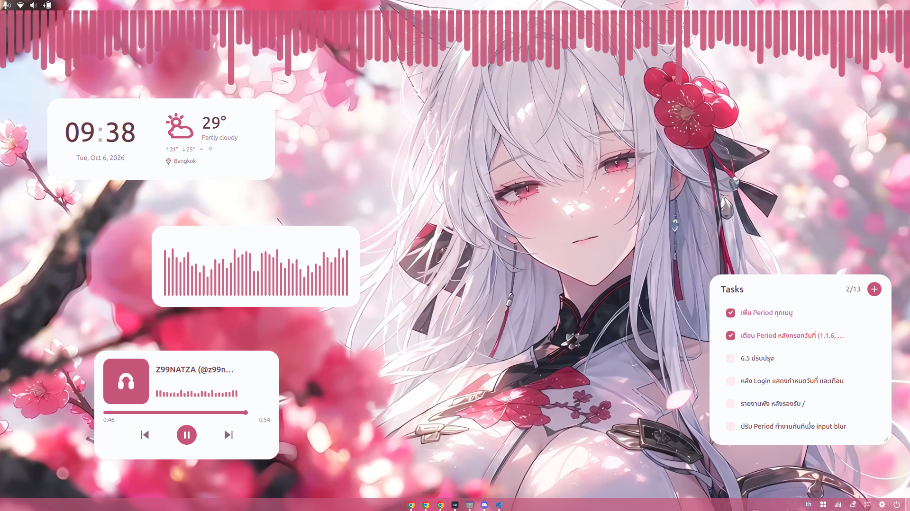

# Zhyprbola




## Stack

```text
Shell:   GNOME Shell Extension (GJS)
Panels:  Qt Quick / QML
Backend: C++ / Qt
Build:   qmake6 + make
```

## Setup

```text
Debian/Ubuntu base tools
$ sudo apt install qt6-base-dev qt6-declarative-dev qmake6 gnome-shell-extensions \
    libxkbcommon-dev libglib2.0-dev acl

Optional runtime helpers
$ sudo apt install qml6-module-qtquick-controls playerctl cava network-manager bluez

Optional brightness control for external monitors with DDC/CI enabled
$ sudo apt install ddcutil

Optional AT-SPI support for Key visualizer (GNOME may deny global monitoring)
$ sudo apt install gjs gir1.2-atspi-2.0 gir1.2-gtk-4.0
```

## Run

```text
$ make dock

Builds the QML panel host, installs the local GNOME extension,
and enables the dock.

The dock may appear immediately. If GNOME does not load the updated extension,
log out and back in. Some sessions or machines may need that after each update.
```

## Development

```text
Build without installing the GNOME extension
$ make build

Run focused panels directly
$ make run-panel
$ ./scripts/run-panel bluetooth
$ ./scripts/run-panel wifi
$ ./scripts/run-panel clock-weather
$ ./scripts/run-panel key-visualizer
$ ./scripts/run-panel system-status

Key visualizer settings are under Settings > Keys. While its bubble is visible,
the panel shows keys typed in other applications only when GNOME grants
keyboard monitoring or keyboard-device read access is granted. On GNOME
Wayland, use the "Allow temporarily" button in Key visualizer when prompted.
If the desktop cannot show the authorization dialog, grant temporary read
access from a terminal and reopen Key visualizer:
$ ./scripts/grant-key-capture

The button opens system authentication; the terminal command prompts for
sudo. Access lasts until reboot/device reconnect and allows other programs
running as your user to read those devices too. Do not use it on a
shared account. Minimize Key visualizer before entering passwords.

Edge spectrum is managed by the GNOME dock extension. Enable it and choose
an edge in Settings → Spectrum; the original spectrum bubble remains available.

QML lint checks
make check currently exits successfully but may print existing qmllint warnings.
$ make check
```

## LICENSE

MIT [LICENSE](LICENSE)
